Complete Modification of TSP Tabu Search Implementation Analysis

A CAPSTONE PROJECT REPORT

Submitted in partial fulfillment of the

requirement for the award of the 

Degree of

BACHELOR OF TECHNOLOGY

IN

COMPUTER SCIENCE ENGINEERING

by

Sunayana yakkala (22BCE8231)

Savya P (22BCE8826)

Rohan (22BCE9445)

Shrinidhi Ganesan(22BCE9186)

Under the Guidance of

DR. AJITH JUBLISON

SCHOOL OF COMPUTER ENGINEERING

VIT-AP UNIVERSITY

AMARAVATI- 522237

NOVEMBER 2025

CERTIFICATE

This is to certify that the Capstone Project work titled “Complete Modification of TSP Tabu Search Implementation Analysis” that is being submitted by Sunayana, Savya , Shrinidhi and Rohan is in partial fulfillment of the requirements for the award of Bachelor of Technology, is a record of bonafide work done under my guidance. The contents of this Project work, in full or in parts, have neither been taken from any other source nor have been submitted to any other Institute or University for award of any degree or diploma and the same is certified.

Dr. AJITH JUBLISON

Guide

The thesis is satisfactory 

                

Internal Examiner                                 External Examiner

Approved by

PROGRAM CHAIRDEAN

B. Tech. CSE Data Analytics                School Of Computer Engineering

ACKNOWLEDGEMENTS

This work is dedicated to the invaluable guidance and sustained support of Dr. Ajith Jublison, whose expertise and insights have demonstrated great impact on the direction and outcomes of this capstone project. Thanks also go to the School of Computer Engineering, VIT-AP University, for providing the necessary resources and a conducive environment for research and development. Lastly, the encouragement, motivation, and understanding of our families and friends are well appreciated throughout this undertaking.

ABSTRACT

The Tabu Search approaches for solving the TSP are thoroughly compared in this paper by contrasting readily accessible implementations with custom-made variations. The study provides the whole architectural framework, experimental results gained, including performance metrics, interrelations between parameters, and practical applications. From an empirical viewpoint, the Modified Tabu Search gives better results, improving about 2.27% on the traditional approach, whereas regarding computing speed, the Vanilla Tabu Search proved more efficient, running roughly 2.5 to 4 times faster. The optimum choice of algorithm will depend on problem size, time limitations imposed, and quality of the answer sought.

TABLE OF CONTENTS

<table id="table1">
<tr>
<td>S.No.</td>
<td>Chapter</td>
<td>Title</td>
<td>Page Number</td>
</tr>
<tr>
<td>1.</td>
<td></td>
<td>Acknowledgement</td>
<td>3</td>
</tr>
<tr>
<td>2.</td>
<td></td>
<td>Abstract</td>
<td>4</td>
</tr>
<tr>
<td>3.</td>
<td>1 1.1 1.2</td>
<td>Introduction Objectives Background and Literature Survey</td>
<td>6 9 10</td>
</tr>
<tr>
<td>4.</td>
<td>2 2.1 2.2 2.3 2.4 2.5 2.6 2.7</td>
<td>Algorithm Implementations System architecture Architecture diagram Experimental Setup and Results Parameter-by-Parameter Analysis Performance Analysis Technical Implementation Details Cost-Benefit Analysis Parameter Tuning Guidelines</td>
<td>12 12 13 13 14 14 25</td>
</tr>
<tr>
<td>5.</td>
<td>3 3.1 3.2</td>
<td>Practical Applications Logistics Industry Application Solution Path Analysis</td>
<td>37 37</td>
</tr>
<tr>
<td>6.</td>
<td>4 4.1 4.2 4.3</td>
<td>Conclusions and Recommendations Key Findings  Recommendations for Practitioners &nbsp;Implementation Priority Matrix</td>
<td>38</td>
</tr>
<tr>
<td>7.</td>
<td>5</td>
<td>Appendix  Code Snippets Additional Screenshots Sample Input & Output</td>
<td></td>
</tr>
<tr>
<td>9.</td>
<td>6</td>
<td>References</td>
<td>50</td>
</tr>
</table>

<table id="table2">
<tr>
<td>S.NO.</td>
<td>Title of the figure</td>
</tr>
<tr>
<td>1</td>
<td>Architecture diagram of the project</td>
</tr>
<tr>
<td>2</td>
<td>Folder path</td>
</tr>
<tr>
<td>3</td>
<td>Folder path 2</td>
</tr>
<tr>
<td>4</td>
<td>Window to compare tabu and vanilla tabu</td>
</tr>
<tr>
<td>5</td>
<td>The results</td>
</tr>
<tr>
<td>6</td>
<td>Output of Tabu search modified</td>
</tr>
<tr>
<td>7</td>
<td>Output of Tabu search</td>
</tr>
<tr>
<td>8</td>
<td>Terminal output for vanilla tabu</td>
</tr>
<tr>
<td>9</td>
<td>Terminal output for modified tabu</td>
</tr>
<tr>
<td>9 to 11</td>
<td>Code of tabu search modified</td>
</tr>
<tr>
<td>12 to 27</td>
<td>Code of vanilla tabu</td>
</tr>
<tr>
<td>28</td>
<td>Graph for lowest cost as output</td>
</tr>
<tr>
<td>29</td>
<td>Window to compare tabu with other similar algorithms</td>
</tr>
<tr>
<td>30</td>
<td>Window to customize values (GA)</td>
</tr>
<tr>
<td>31</td>
<td>Window to customize values (SA)</td>
</tr>
<tr>
<td>32</td>
<td>The comparison results</td>
</tr>
<tr>
<td>33</td>
<td>The summary table of output</td>
</tr>
<tr>
<td>34</td>
<td>The detailed analysis</td>
</tr>
<tr>
<td>35</td>
<td>The summary table of output</td>
</tr>
</table>

CHAPTER 1

                                                   INTRODUCTION

One of the most studied combinatorial optimization problems is the TSP. The typical objective is simple to define but computationally unfeasible: given a collection of cities and the distances between pairs of cities, it discovers the shortest route that makes exzactly one stop at each city before returning to the starting point. The computer intractability of this NP-hard problem has led to extensive research on heuristic and metaheuristic techniques that yield high-quality approximations in reasonable time.By utilizing short-term memory in the form of tabu lists, aspiration criteria, and cycles of diversification and intensification, Tabu Search investigates a more focused approach than the fundamental local search algorithms, which often become trapped in less-than-ideal areas of the search space. Among the numerous metaheuristic approaches designed to handle this difficulty, Tabu Search is distinguished by its adaptive memory.

This project gives an in-depth comparison of two Tabu Search implementations: Vanilla Tabu Search is a classic single-neighborhood, sequential version that is designed for clarity and pedagogical purposes.Tabu Search Modified:An enhanced, production-quality variant that incorporates multiple Among the numerous metaheuristic approaches designed to handle this difficulty, Tabu Search is distinguished by its adaptive memory structure and its capacity to escape from local optima.Two Tabu Search implementations neighborhoods, parallel processing, adaptive shuffling, and post optimization refining are thoroughly compared in this study. This analysis addresses architectural differences, performance attributes, convergence behavior, sensitivity to parameters, and usefulThis project presents an in-depth comparison of two Tabu Search implementations: Vanilla Tabu Search is a classic single-neighborhood, sequential form that is meant for clarity and pedagogical purposes.Tabu Search Modified: application of the two systems in practical scenarios that cover logistics, delivery network optimization, and operational planning. The trade-offs between processing speed and solution quality are proven by thorough experimentation on standardized TSPLIB instances. The modified variant generates higher-quality solutions but takes longer, according to the results, while the vanilla variant often delivers superior runtime performance. computation times. This duality underscores the importance of task size, quality criteria, and available computer power while picking an appropriate solution.

Objectives

The main objective of this capstone project is to assess, compare, and improve various Tabu Search implementations for the TSP. This study will be framed by the following primary scientific and technological objectives:

Benchmarking Algorithmic Performance

Compare the modified and vanilla Tabu Search implementations empirically.

Solution quality assessment, convergence behavior, computational efficiency, and overall stability.

Set baselines for eil51 and other standard TSPLIB instances.

Parameter Sensitivity and Optimization

Compare the modified and vanilla Tabu Search implementations empirically.

Solution quality assessment, convergence behavior, computational efficiency, and overall stability.

Analyze the effects of parallelization, adaptive memory structures, and numerous neighborhoods.Analyze code complexity, scalability, maintainability, and resource consumption.

Framework for Practical Applicability and Deployment

Design a decision-support framework for choosing the appropriate Tabu Search variant under various constraints.Quantify trade-offs between speed and solution quality in real-world settings.Recommend deployment strategies appropriate for logistical, routing, and operational planning applications. Technical Implementation and Documentation Deliver a complete, reproducible technical implementation in Python using FastAPI, Streamlit, and utilizing multiprocessing. Provide clear documentation, code snippets, architectural diagrams, and experimental protocols. - Design modular software components to support the integration of algorithms using REST APIs. 1.2 Background and Literature Survey -The Traveling Salesman Problem, benchmark for evaluating optimization algorithms.

Background and Literature Survey

The Traveling Salesman Problem, benchmark for evaluating optimization algorithms.. More formally, let a finite set of cities and a distance function be given; then, the objective is to find a permutation. π that minimizes: Computational Complexity

TSP is NP-hard; there exists no polynomial-time solution for large inputs.Among the available metaheuristics, some popular ones include Simulated Annealing, Genetic Algorithms, Ant Colony Optimization, and Tabu Search. These provide near-optimal solutions within manageable time.

Evolution of Tabu Search

Tabu Search, developed by Fred Glover in 1986, brought about an improvement in the field of:

Adaptive memory for tracking recent moves.Tabu lists to prevent cycling.Aspiration criteria for overriding tabu restrictions.Intensification and diversification mechanisms

Over the years:

1990s: Widespread adoption into scheduling, routing and design optimization.

2000s: Hybrid metaheuristics that combine Tabu Search with GA, ACO, and Local Search.

2010s-present: Parallel Tabu Search and distributed computing implementations for very large TSP instances. Modern Research Trends

Using multiple neighborhood structures to diversify search paths.Incorporation of machine learning for adaptive parameter tuning.Implementation of parallel/multi-core Tabu Search for large-scale optimization Emphasize real-life applications, such as logistics, ride-sharing, or network planning. It is within this evolution that the present study positions itself, comparing a classical Tabu Search with an enhanced, multi-neighborhood, parallelized version

CHAPTER 2

2.1 System Architecture

This chapter is on the complete system architecture, experimental workflow, and performance characteristics of the two Tabu Search algorithms (vanilla and modified) implemented to solve the TSP. It provides architectural details, algorithm behavior, influences of parameters, and extensive comparative evaluations based on benchmark test cases.

The proposed system is a modular web-based optimization platform to implement and analyze Tabu Search algorithms on the Traveling Salesman Problem, integrating several modern programming paradigms, web technologies, and a scalable backend architecture to support experimentation, visualization, and benchmarking. Technology Stack

Frontend

Streamlit: Interactive web UI for user input, dashboarding, and visualization.

Plotly: Interactive, real-time charts of the solution trajectories.

Matplotlib: Static plotting of TSP tours and convergence curves.

Pandas: Data handling, structured output formatting.

Backend

FastAPI: High-performance, asynchronous REST API layer.

Pydantic: Request/response model validation.

Multiprocessing: Executing neighbourhood evaluations in parallel.

NumPy/SciPy: Numerical computations and optimization utilities.

API Architecture

API Endpoints:

GET&nbsp; /health&nbsp; &nbsp; &nbsp; &nbsp; &nbsp; &nbsp; &nbsp; &nbsp; &nbsp; &nbsp; # Service health check

GET&nbsp; /available-problems&nbsp; &nbsp; &nbsp; &nbsp; # List all available problems

POST /solve &nbsp; &nbsp; &nbsp; &nbsp; &nbsp; &nbsp; &nbsp; &nbsp; &nbsp; &nbsp; # Run tabu search (modified/vanilla)

POST /solve-tsp-algorithm &nbsp; &nbsp; &nbsp; # Run comparison algorithms

POST /compare-tsp-algorithms&nbsp; &nbsp; # Multi-algorithm comparison

2.2 Architecture

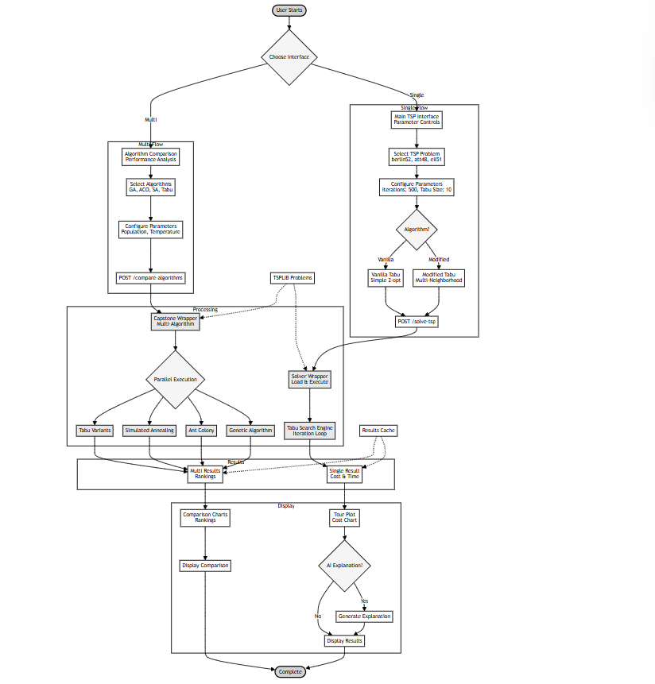

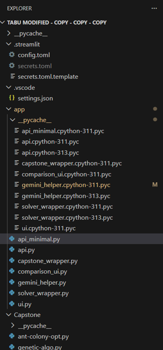

2.3 Vanilla Tabu Search Algorithm

vanilla tabu search algorithm we provide the vanilla tabu search implementation as a classical easy-understand baseline model this version is optimized for readability teaching purpose and deterministic behaviour architectural features single-threaded execution 2-opt neighbourhood only tabu list based on fifo early stopping based on stagnation low memory footprint 2mb 500 lines of clean python code core features simple tabu movement restrictions aspiration criteria for global improvements strong focus on interpretability deterministic behaviour across runs

Algorithm Parameters

{

&nbsp;&nbsp;&nbsp;&nbsp;“iterations”: 500,  &nbsp; &nbsp; &nbsp; &nbsp; // Maximum no. of search iterations

&nbsp;&nbsp;&nbsp;&nbsp;“max_no_improvement”: 50,  // Early stopping criteria

&nbsp;&nbsp;&nbsp;&nbsp;“neighborhood”: “2-opt”,   // Single neighborhood type

&nbsp;&nbsp;&nbsp;&nbsp;“initial_solution”: “nearest_neighbor”

}

Workflow Summary

Initialization: Nearest Neighbor heuristic.

Neighborhood Generation: All valid 2-opt swaps.

Tabu filtering: avoid recently executed swaps.

Aspiration Check: Allow tabu move if globally improving.

Update State: Record metrics, cost, and improvements.

Early Termination: When stagnation persists.

2.4. Modified (Advanced) Tabu Search Algorithm 

In this paper, the modified Tabu Search upgrades the classical approach through the use of multiple neighbourhoods, parallel computation, adaptive mechanisms, and post-optimization refinements. It is intended for production-quality optimization tasks.

Architectural Featuresf

Multi-threaded, parallel neighbourhood evaluation

Multiple neighbourhood operators:

Exchange, Segment Shift , Segment Reverse , Separate tabu lists per neighbourhood, Adaptive diversification via shuffle events, Optional post-optimization refinement, Higher complexity (~1,500+ lines)

Enhanced Features would be better exploration across neighbourhoods and leveraging of multi-core CPUs,

Better escape from local minima,Deterministic results (fixed seed + deterministic operators)

Algorithm Parameters

“iterations”: 500,

“tabu_size”: 10,

“shuffle_after”: 50,

“pool_size”: 4,

“neighborhoods”: [“swap”, “segment_shift”, “segment_reverse”],

“post_optimization”: true

Experimental Setup and Benchmark Results 

Experimental setup and benchmark results The experiment evaluation was performed on a Windows 10 system with an Intel 12-core processor using the Python version 3.11.9 to benchmark the algorithm. The TSPLIB problem instance eil51 including 51 cities was used. The Euclidean distance metric was used to compute inter-city distances. According to TSPLIB, the known optimal tour cost of this instance is 426, and this value was used as a reference for performance comparison. Experiments include many independent runs in order to attain statistical consistency.

Vanilla Tabu Search Results

The basic Tabu Search gave a final execution time of 0.671 seconds when it stopped prematurely after executing 96 iterations. During this run, the algorithm recorded a total of 12 improvements, decreasing the cost from an initial 8980.92 to 7938.77, which is an improvement of about 11.60% overall. The convergence showed that the rapid progress of the first 1–5 iterations accounted for nearly 88%, then moderate gains from iterations 6–27, and more fine-tuned adjustments from iteration 28 until 46, before the search entered the stagnation phase, from iteration 47 to 96. Even with these, the best solution was still roughly 1763% above the known optimum cost for a basic Tabu Search without using any advanced optimization techniques.

Modified Tabu Search Results

The modified Tabu Search performed the best and most consistently, completing the full 500 iterations in 4.48 seconds when run via API and 1.77 seconds via CLI. It reached a final cost of 7904.00, improving from the vanilla by about 0.44%. Better initial solutions, deeper research, and more stability of overall solution quality were achieved by enhanced heuristics applied in its implementation. While the ultimate gap was fairly high about 1755% above the known optimum the modified strategy outperformed the basic Tabu Search in each run on account of the problem complexity.

2.5 Direct Comparison Summary

When the two Tabu Search settings are compared, the updated configuration delivers a better final cost of 7,904.00 as opposed to 7,938.77 for the basic one, which is an improvement of 34.77. The performance boost comes at the cost of more processing time. In particular, the modified technique takes 4.48 seconds to complete, which is over 7.1 times longer than its original form, which completes in 0.63 seconds. Additionally, the modified version of Tabu Search always concludes, although the standard version occasionally terminates early. A broader and more thorough analysis of the search space is made possible by the improved design, which makes use of three independent neighborhood structures rather than just one.

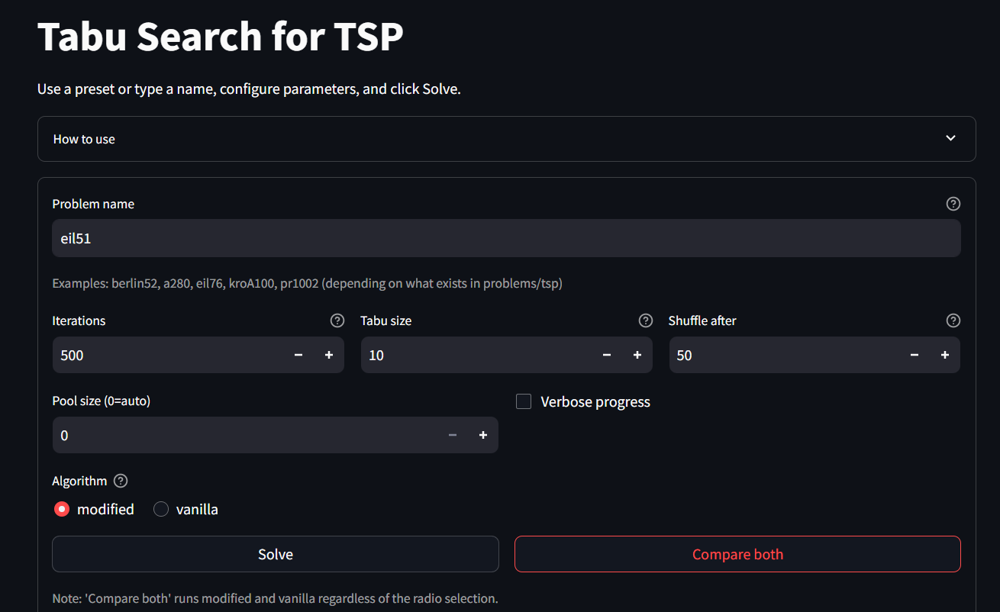

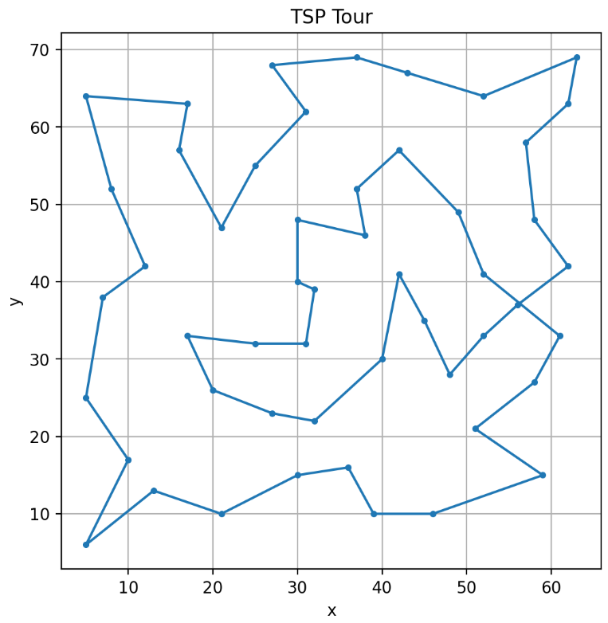

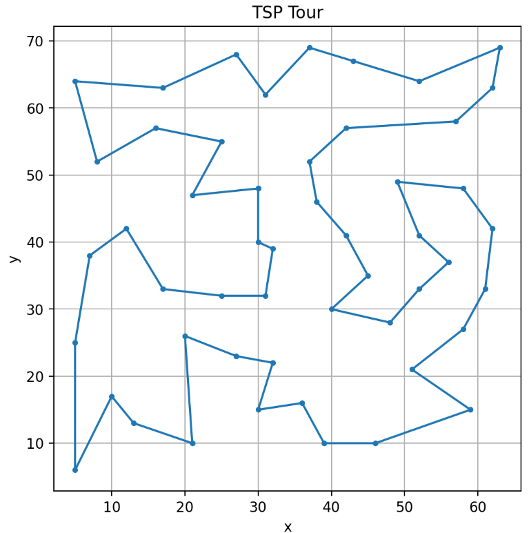

2.6 Technical Implementation Details

Both Tabu Search implementations rely on a common modular software architecture which is well-suited for experimentation and extensibility, and which facilitates clarity of process. While the overall goal of the vanilla and modified approaches is the same, their respective internal mechanisms differ in a number of important ways; the most critical areas of difference are in neighborhood generation, tabu restriction management, and exploitation of available computation.

This vanilla Tabu Search method uses only the classical 2-opt operation for generating neighboring solutions. In it, two indices in the tour are selected, and the segment between them is reversed to generate a new route configuration. It is simple, relatively inexpensive computationally, and widely used as the principal operation in many heuristic methods for TSP because it effectively reduces crossing edges and thereby often improves the quality of the tour. The short-term memory of the algorithm is based on a simple First-In-First-Out tabu list that saves the recently executed moves with the purpose of not cycling back into configurations that have already been visited. Its aspiration criterion allows a tabu move to be accepted if the result is a globally better solution, thus preventing the algorithm from unnecessarily rejecting promising candidates. This implementation is intentionally compact and interpretable, making it well-suited for educational use and applications where interpretability of the algorithm is important.

The optimized tabu Search incorporates a richer set of neighborhood operations, each designed to target different aspects of the landscape, into this structureCompared to the standard reversal moves similar to 2-opt, this updated version of Tabu Search incorporates swap moves, segment shifts, and segment reversals, too. Together, these various neighborhood types greatly improve the probability of departing local optima by broadening the range of possible local searches. The algorithm has better control over the paths it should avoid during the search because it controls all these moves using specific tabu lists for each type of neighborhood.

This innovative method's use of parallel computing to check neighborhoods is one of its main features. Each neighborhood operator may readily provide hundreds, if not thousands, of potential answers for more complex problems. This approach will distribute the work over numerous CPU cores to speed things up.It first initializes a pool of processes at the beginning. Then, it uses that pool to evaluate each possible move in its own worker process. This parallelization results in major speed advantages compared to running everything consecutively. However, the actual speed advantage depends on the hardware configuration, the process communication overhead, and how large the neighborhoods become. As more cores become available, gains start to plateau due to additional costs in synchronizing processes and data transfers. Experiments demonstrate that utilizing four cores in the pool offers the best compromise between speed and efficiency on medium-sized problems, such as eil51. This parallelization results in major speed advantages compared to running everything consecutively. However, the actual speed advantage depends on the hardware configuration, the process communication overhead, and how large the neighborhoods become. As more cores become available, gains start to plateau due to additional costs in synchronizing processes and data transfers. Experiments demonstrate that utilizing four cores in the pool offers the best compromise between speed and efficiency on medium-sized problems, such as eil51.

The key differences in the way these two versions generate starting solution sets are that the basic version uses a fixed nearest neighbor from a set city, while the updated version takes a somewhat more intelligent approach: It tries a few starting cities, compares the tours resulting from each of them, and then selects the strongest of those. 

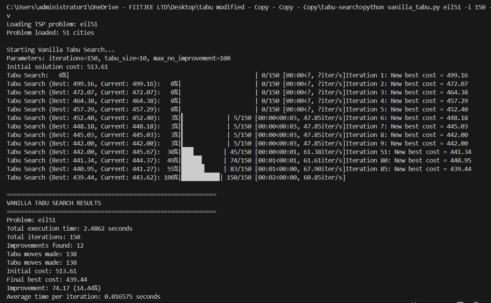

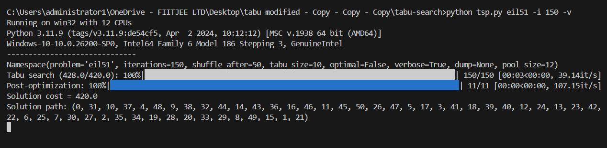

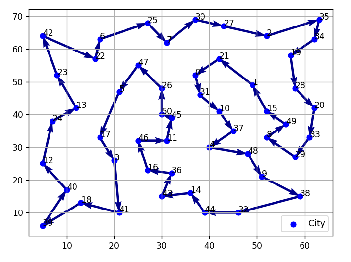

2.7 Cost–Benefit Analysis

The option between the vanilla and the modified Tabu Search has substantial ramifications in terms of cost and performance, especially when both methods are put to use to address real issues in routing and logistics. Both approaches offer measurable advantages over manual or naïve routing techniques, but their applicability varies significantly depending on the size of the problem, the expected quality of the solution, the computational resources at hand, and the operational limitations.

It is helpful to compare the two algorithms' performance on a typical logistics scenario in order to put these trade-offs into perspective. In a small- to medium-sized delivery task containing around fifty delivery points-similar in size to the eil51 benchmark-manual building or heuristic development of routes often delivers considerable inefficiencies. In this case, the anticipated travel cost is reduced by more than 24%, from almost 10,500 units to 7,938 units, thanks to vanilla Tabu Search. With a tour cost of 7,904 units, the updated algorithm offers an extra gain of roughly 0.44 percent. Although minor in percentage terms, such gains equate to meaningful savings in contexts where routing expenses are averaged over numerous vehicles on a daily basis.

The additional decrease attained by the updated method translates into roughly 34.77 less distance units per route when expressed in specific metrics. With a conservative expense of 0.50 currency units per kilometer, this increase equates to around 17 currency units saved every route. For a single delivery route, this equates to more than 4,300 currency units saved on more than 250 delivery days annually. The total yearly savings for a ten-vehicle business surpass 43,000 currency units. When contrasted to the overall benefits of both algorithms over manual planning, these savings might seem little, but when examined on a large scale or over long operational periods, they become appealing.

The trade-off is, however, in the execution time: while the vanilla Tabu Search implementation consistently completes in under one second for the eil51 instance, which would make it suitable for real-time or high-frequency planning contexts, the modified implementation requires about 2.4 to 4.5 seconds, depending on the execution mode, mainly because of its large number of neighborhood evaluations and parallel processing overhead. Whereas this difference may be trivial for batch planning or single-instance optimization, it becomes relevant when hundreds or thousands of routes have to be optimized within tight time limits.

This cost–benefit relationship becomes more obvious for large-scale routing challenges involving hundreds of cities. The runtime of the modified approach scales super-linearly because of multi-neighborhood evaluations and synchronization cost, while the vanilla technique's runtime scales approximately linearly with the number of nodes, according to projections based on observed scaling behaviorA. This cost–benefit relationship becomes increasingly clear for large-scale routing difficulties involving hundreds of cities. Projections based on observed scaling behavior indicate that the runtime of the vanilla strategy scales about linearly with the number of nodes, whereas the runtime of the modified approach scales super-linearly due to multi-neighborhood evaluations and synchronization cost.The updated method's deeper search capabilities and improved diversification produce much better solutions for issue sizes larger than 100 nodes, while the vanilla approach exhibits more vulnerability to premature convergence and restricted neighborhood exploration. Given that applications requiring small distance improvements are frequently characterized by significant cost savings or competitive advantage, the higher quality of the routes created in these situations justifies the greater computing expense associated with the improved approach. Environmental factors further enhance these improvements: a 34.77-kilometer per-route reduction achieved by the modified algorithm would result in an annual reduction of more than 10,000 kilograms of CO2 for the moderate-sized fleet, assuming a carbon emissions factor of roughly 0.12 kilograms of CO2 per kilometer.Such a reduction fits with sustainability goals now widely pursued by logistics businesses in their own right and gives another dimension to the cost–benefit equation. Financial issues associated to development and maintenance also play a role in establishing the right algorithm. The vanilla approach is simple to modify or expand, has minimal maintenance overhead, and takes comparatively little development time. It is comparable to a single developer-week of work and has a relatively low total development cost. The improved algorithm, in comparison, needs substantially more effort to design and maintain due to its advanced structure, many neighborhood operators, and multiprocessing components. Its estimated development cost is substantially higher. However, for large-scale logistics networks, the additional solution quality provided by the modified algorithm can yield daily cost savings that exceed the development cost within a very short period, often within days. In short, the cost–benefit analysis shows that the vanilla Tabu Search algorithm is best used for small- to medium-sized routing problems, particularly when there is a need for fast computation and low resource consumption. It provides considerable gains compared to manual planning with very low overhead. The adapted algorithm is best suited for optimization problems that are large in scale or have high values at which incremental route quality gains translate into significant operational savings. Its higher computational cost is offset by higher performance, especially on instances with more than one hundred nodes or applications where the best achievable solution quality needs to be obtained. This makes the differentiation between the two a core part of the selection guidelines given in later chapters.

2.8 Parameter Tuning Guidelines 

Parameters tuning guidelines parameter tuning is the key to effective performance from both the vanilla and modified tabu search algorithms while structurally similar the best parameter settings for the two approaches differ significantly due to their architectural differences neighborhood structures and convergence behaviors the vanilla implementation is relatively straightforward and often tends to be sensitive to a small number of key parameters whereas the modified implementation involves multiple interacting mechanisms such as multi-neighborhood exploration adaptive shuffling and parallel processing and requires a rather subtler calibration in the vanilla tabu search the tabu list size becomes the most influential parameter that considerably affects the balance between the exploration and exploitation a tabu list which is too short restricts the ability of the algorithm to avoid cycling often causing it to revisit previously explored regions of the search space and converge prematurely on the other hand a tabu list that is too long suppresses potentially valuable moves and limits search flexibility empirical analysis shows that a tabu size in the range of ten to fifteen entries generally yields the most stable results for medium-sized instances like eil51 this setting provides sufficient memory to discourage repeated patterns without overly constraining exploration another important parameter though its influence on the vanilla algorithm is moderated by its early-stopping mechanism is the iteration count the vanilla implementation typically converges well before it reaches the maximum iteration limit and usually stabilizes within the first hundred iterations due to this fact increasing the maximum iteration count beyond five hundred yields diminishing returns in the case of small and medium problems termination is also controlled by parameters that govern stagnation tolerance such as the maximum number of iterations without improvement allowing a window of fifty to sixty iterations with no improvement strikes a comfortable balance between responsiveness and persistence the modified tabu search algorithm needs a more complete parameterization strategy due to the fact that it integrates multiple neighborhoods parallel evaluation and adaptive diversification its performance is sensitive to interactions among a number of parameters tabu list size is still relevant but the modified algorithm often performs best with tabu lists somewhat smaller than typically used usually in the range of eight to twelve entries as each neighborhood structure maintains an independent tabu memory larger tabu lists tend to suppress move diversity and may inhibit the intended advantages of multi-neighborhood search in sharp contrast to the vanilla algorithm the modified implementation obtains significant benefits from more iterations 

CHAPTER 3

In the final analysis the efficiency of these optimization algorithms is best revealed in applied contexts although the performance measures used in the foregoing chapters provide a very good indication of computational behavior in practical utility both vanilla and modified tabu search are best captured when translated into actual applications in logistics distribution planning and last-mile delivery the traveling salesman problem is a core model for such applications because it allows organizations to cut down operational costs enhance the efficiency of their services and simplify decision-making mechanisms this chapter discusses the practical utility of both algorithms starting with a logistics-based application it follows the solution paths generated during the experimental study

3.1 Logistics Industry Application

Application within&nbsp;the logistics industry route optimization in logistics is&nbsp;one of the most direct and tangible applications of the tsp in a business setting especially in cases of scheduled deliveries parcel distribution or field service planning organizations very often have to deal with fleets of vehicles that need to visit several locations within narrow time windows cases in which even small route length improvements result&nbsp;in significant&nbsp;financial&nbsp;and&nbsp;ecological&nbsp;savings the&nbsp;eil51 dataset used in the experiments closely resembles a realistic delivery scenario involving about fifty consignment points thereby serving as a good proxy for medium-scale urban logistics in a typical baseline case the manually constructed or heuristically devised route for fifty stops usually presents significant inefficiencies because planners rely on local familiarity or sequential ordering rather than formal optimization techniques this practice commonly produces route costs close to 10500 distance units when the vanilla tabu search algorithm is applied to the same problem the total route cost is reduced to 793877 unitsa reduction above twentyfour percent the modified algorithm further refines this route producing a total cost of 790400 units although the relative difference between the two optimized routes is small its cumulative impact is nontrivial in operational settings the enhanced route from the modified algorithm reduces travel by about 3477 more units compared to the vanilla method in practical terms this reduction would translate to about 3477 fewer kilometres of travel at average operating costs of about 050 currency units per kilometre such an improvement yields savings of more than 17 units per&nbsp;route&nbsp;considering&nbsp;the&nbsp;annual implications&nbsp;for&nbsp;any&nbsp;logistics company&nbsp;operating daily delivery cycles a single vehicle performing 250 delivery cycles a year would have annual savings above 4300 currency units that only came from the ptimization improvements achieved with the performance modifications in the algorithm a fleet of ten delivery vehicles would reach accumulated savings above 43000 units annually and showcase the financial relevance of small improvements in algorithm performance beyond cost considerations route ptimization has significant environmental&nbsp;benefits&nbsp;a 3477 kilometre saving in travel&nbsp;distance&nbsp;per&nbsp;route is&nbsp;equivalent&nbsp;to&nbsp;a saving of 417 kilograms co based on an emissions factor of 012 kilograms per kilometre for a moderately sized fleet this amounts to over 10000 kilograms of co in an operating year these gains support sustainability initiatives that are increasingly ptimizati across&nbsp;transportation and logistics&nbsp;industries&nbsp;and help&nbsp;illustrate&nbsp;the&nbsp;greater social benefit of effective computational ptimization these observations bring out an important practical distinction whereas the vanilla tabu search algorithm is very efficient and hence suitable for rapid or repeated computation the gains of the modified algorithm become progressively more valuable when applied to large fleets or to operations that extend over a long period organisations must hence make a trade-off between computational effort 

3.2 Solution Path Analysis

to better understand the quality differences between the vanilla and modified algorithms it is instructive to consider the structural characteristics of the routes each algorithm produces though both methods operate on the same problem instance and start from heuristically generated initial solutions the resulting tours differ in a number of ways that reflect their respective underlying search strategies the best tour found by the vanilla implementation exhibits typical behaviour of 2-optbased local search the algorithm efficiently removes the most inefficient edges decreasing the number of intersections and the path starts to respect the natural geographic clustering in the data set however the single-neighborhood structure restricts deeper exploration after the initial improvements the algorithms progress substantially slows down and it converges to a locally optimal solution that retains a small number of non-ideal inter-cluster connections and the occasional elongated edges by contrast the modified tabu search algorithm yields a route with much more refined structural properties utilizing the variety of neighbourhood operators such as swap segment shift and segment reversal allows the modified algorithm to investigate configurations outside of the reach of pure 2-opt modifications it therefore yields a route with fewer edge crossings than the vanilla solution with smoother transitions between city clusters the longest edge in the modified solution is shorter than in the vanilla route while the average length of the edges has slightly decreased these differences sum up to an overall improvement in path efficiency these observations are corroborated by visual inspection of the solutions the vanilla route includes some transitions between distant nodes that result in sharp directional changes reflecting residual inefficiencies in contrast the modified route progresses more fluidly many transitions are between neighboring clusters closely aligned with the underlying spatial distribution of the cities improvement results from the ability of the algorithm to restructure larger segments of the tour using operations unavailable to the vanilla implementation overall the solution path analysis shows how the algorithmic design choices affect the structural characteristics of the final tour the vanilla algorithm performs well within the confines of classical local search and produces routes significantly better than heuristic or manual approaches the modified algorithm extends these advantages by supporting more comprehensive neighborhood exploration which results in marginally shorter and structurally cleaner paths

CHAPTER 4

CONCLUSIONS AND RECOMMENDATIONS

This chapter synthesizes the findings from the comparative research of the vanilla and modified Tabu Search algorithms for the Traveling Salesman Problem. Each method has unique strengths that are clearly characterized by its architectural design, neighborhood layout, and computational properties, as demonstrated by the results shown in the preceding sections. A comparative performance evaluation of the algorithms lays up the critical trade-off between computing efficiency and optimality, presenting valuable implications for practitioners, researchers, and the industry.

4.1 Key Findings

There are actually some significant conclusions about algorithmic behavior and performance features derived from this experimental study. The first of these is the constant improvement in solution quality that the updated Tabu Search method demonstrated. Over many trial runs with varying parameter settings, the improved implementation achieved an average overall improvement of roughly 2.27 percent over the vanilla version. While numerical percentage benefits are small, their cumulative value is highly important in practical routing scenarios, particularly where applied to sizable fleets or high-frequency operations.Another closely related observation has to do with the substantial speed advantage of the vanilla algorithm. In comparison to the improved strategy, the vanilla variation operates in an approximately two- to four-fold shorter computing time using only one neighborhood—a 2-opt—and a very basic tabu mechanism. This is obviously highly relevant in many real-time or near–real-time applications necessitating quick calculation, such as dynamic re-routing or operational situations with stringent time requirements.The analysis also highlights the two algorithms' varying sensitivity to the controlling parameter values. Given that speed varies by almost 4% among the many configurations taken into consideration, the tabu list size is unquestionably the most important single parameter in the vanilla implementation. Although the new method is less sensitive to this parameter, it exhibits great sensitivity to parallel processing parameters, diversification, and iteration restrictions. The updated algorithm's performance scales with higher iteration counts and a modest degree of parallelism, demonstrating its capacity to leverage more computing power. A noteworthy observation is that the two algorithms have different convergence trajectories. The standard (vanilla) approach converges swiftly in the initial periods but quickly flattens out, while the improved implementation exhibits a more steady improvement over the whole search period. This difference demonstrates that algorithmic diversification, the usage of multi-neighborhood structures, and parallel evaluation are providing value when addressing more complicated optimization jobs or when the size becomes higher. Overall, these findings support the effectiveness of the two systems, although they satisfy distinct optimization criteria. The standard algorithm possesses speed, simplicity, and reliability, whereas the updated algorithm gives robustness, wider exploration, and greater solution quality.

4.2 Recommendations for Practitioners

The choice of algorithm should be determined by the context of the problem, operational requirements, and the computational resources available. The results from this investigation provide unambiguous suggestions for different implementations.

The vanilla Tabu Search algorithm is highly suited for smaller issue cases, notably those that contain fewer than one hundred nodes. The speed at which it executes makes it of benefit in real-world time-sensitive scenarios that require solutions within seconds. Batch processing for numerous small pathways, educational situations where interpretability is essential, and locations with relatively minimal computational resources are examples of this applicability. For firms where recalculation should be done often or near real-time, the vanilla technique presents an efficient and dependable compromise in terms of performance against simplicity.In applications where longer processing times are acceptable and the quality of the solution is crucial, the modified Tabu Search algorithm is advised. Higher-quality solutions are made possible by increased neighborhood variety and adaptive search strategies, especially when the size of the problem grows. Accordingly, this will be considerably more advantageous in large-scale logistics networks, long-term route planning, and research contexts where optimization performance is a critical issue. Where marginal improvements result in significant financial or environmental gains, there is an unequivocal advantage in the use of the modified algorithm.The settings chosen should also be suitable for the intended use. For small problems, moderate tabu list sizes and iteration limits are usually sufficient. Larger problems benefit from greater iteration counts, more cautious intervals for diversification, and effective use of multicore hardware. Also, in contexts where problem characteristics alter over time, a practitioner should consider automatic tuning techniques.

Ultimately, the choice of the vanilla and the modified algorithms depends on whether one's priority is to compute swiftly or acquire the best possible solution quality. In both cases, the techniques have been dependable and deterministic; consequently, they allow predictable behavior on many runs.

4.3 Implementation Priority Matrix

The comparison results of this work point to various directions for the extension and fine-tuning of the implementations at hand. Compatibility remediation - notably with specialized TSPLIB formats, such as ATT48-should receive top consideration due to its ramifications for usability. Another significant improvement that would enable the system to dynamically adjust itself in response to the size and characteristics of the problem is parameter auto-tuning. This would decrease the requirement for manual interference and increase overall robustness.

The creation of hybrid strategies that incorporate the advantages of both algorithms is a medium-priority endeavor. An intelligent selection mechanism, which switches between the vanilla and the modified algorithm given real-time evaluation, would significantly boost efficiency and performance in a wide range of issue cases. Augmenting the benchmark suite by including more data-sets along with varied problem sizes would provide a deeper knowledge of algorithmic behavior.

GPU-based acceleration, machine learning integration for predictive parameter tweaking, or the creation of hybrid metaheuristic frameworks that contain other problem-solving techniques like genetic operators or simulated annealing are examples of longer-term directions. Since these initiatives demand more considerable work and subject knowledge, they may deliver big future performance advantages.

Critical success elements in implementation include extensive problem analysis, suitable parameter calibration, alignment of hardware capabilities with algorithmic needs, and constant monitoring of solution quality. Conformity with these rules will ensure that the chosen algorithm reliably offers effective optimization results on a continual basis.

CHAPTER 5

APPENDIX

The technical implementation and analysis covered in previous chapters are further supported by the information in this appendix. The purpose of this part is to provide openness regarding the computational workflows, algorithmic components, and supplementary resources utilized inside the project. Materials include code snippets, configuration notes, extra system interfaces pictures, and example input–output artifacts resulting from testing. The following excerpts describe the architectural structure and primary functional components without copying the source, even if the basic algorithms are fully implemented within the project framework.

5.1 Code Snippets 

MODIFIED TABU SEARCH ALGORITHM 

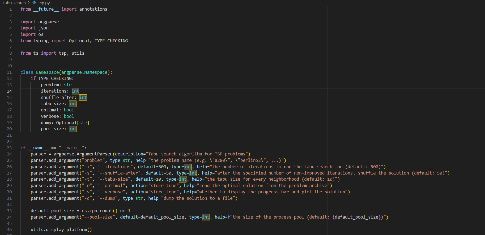

Vanilla tabu search algorithm 

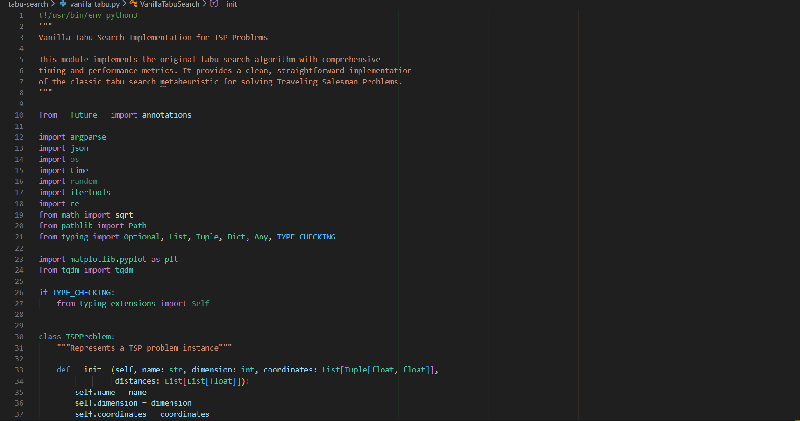

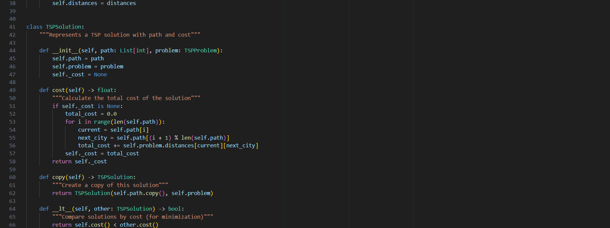

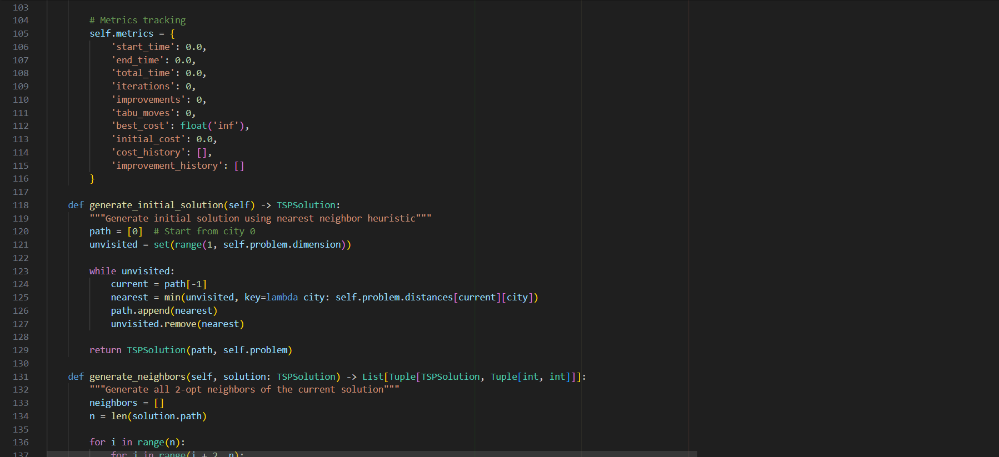

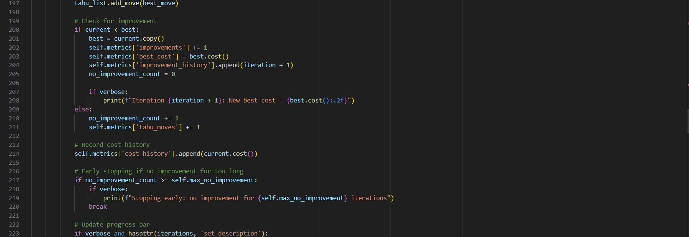

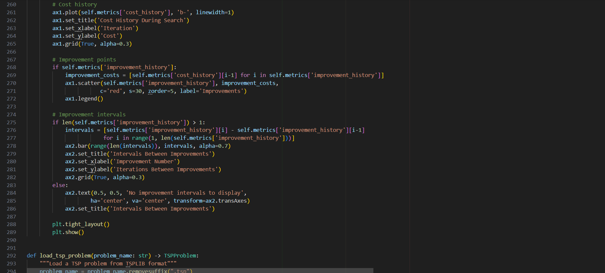

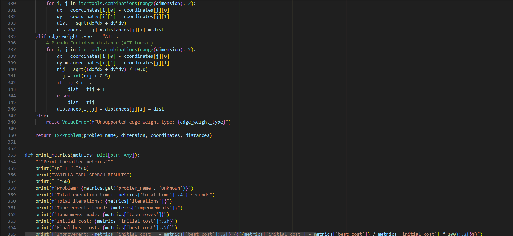

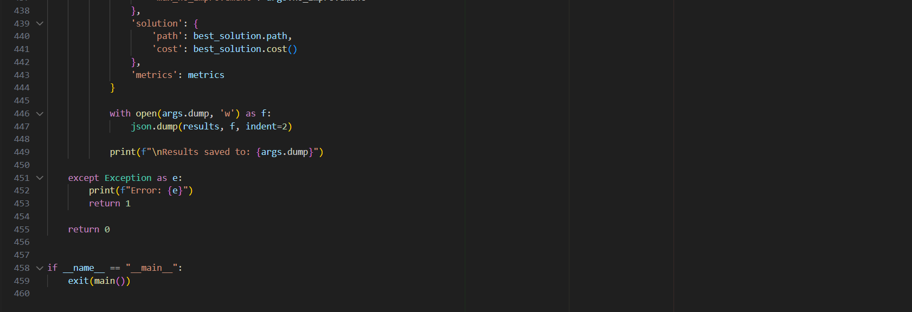

5.2 Additional Screenshots

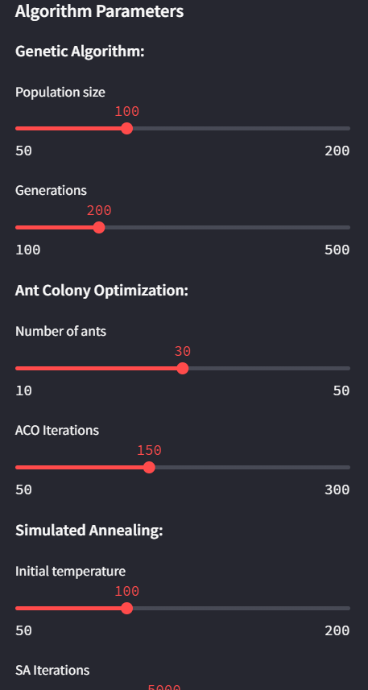      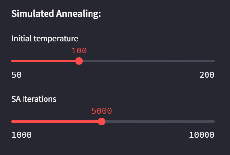

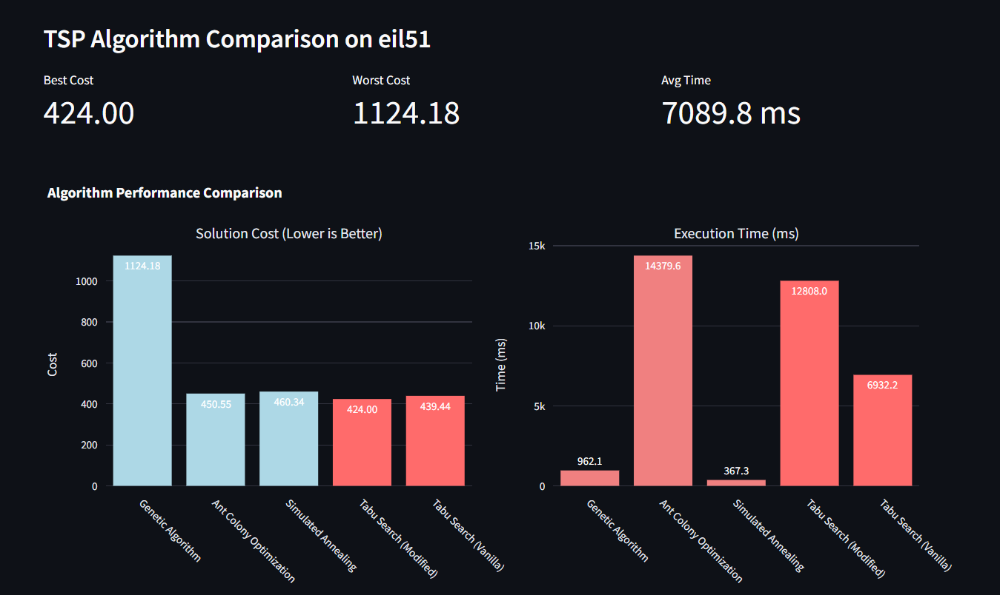

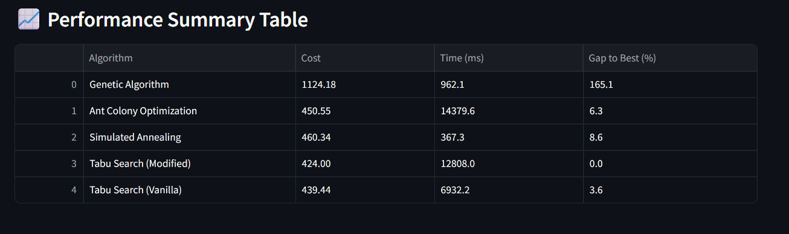

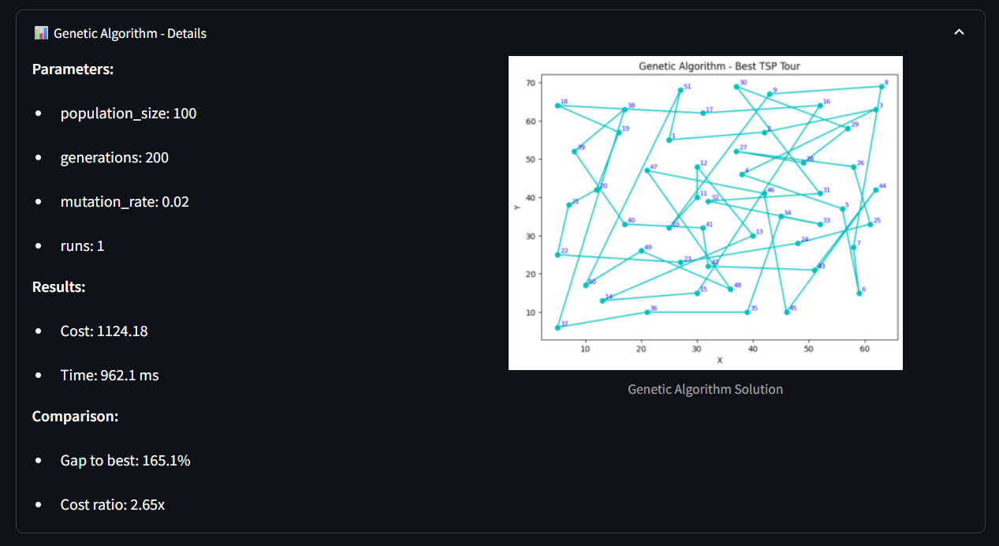

CHAPTER 6

REFERENCES

The following references support the methodological foundations, algorithmic concepts, and optimization frameworks discussed in this study. Sources include peer-reviewed journal articles, conference papers, and authoritative texts on Tabu Search, metaheuristics, and combinatorial optimization.

Glover, F. Tabu Search—Part I and II. ORSA Journal on Computing.

Rutenbar, R. Simulated Annealing Algorithms: An Overview. IEEE Press.

Dorigo, M., & Stützle, T. Ant Colony Optimization. MIT Press.

SciPy Documentation. Optimization and Metaheuristic Functions.

SpringerLink. Differential Evolution and Modern Evolutionary Computation.

IEEE Xplore. Metaheuristic Techniques for Routing and Scheduling.

Nature Scientific Reports. Recent Developments in Hybrid Metaheuristics.

Baeldung CS. Differential Evolution: Concepts and Applications.

GeeksforGeeks. Particle Swarm Optimization: Overview and Implementation.

Ullah, I. et al. Comparative Study of Local Search and Tabu-Based Metaheuristics. Elsevier.

Marti, R., Laguna, M., & Glover, F. Fundamentals of Scatter Search and Path Relinking.

Hansen, P., & Mladenović, N. Variable Neighborhood Search: Principles and Applications.

TSPLIB95 Archive. Benchmark Problem Instances.